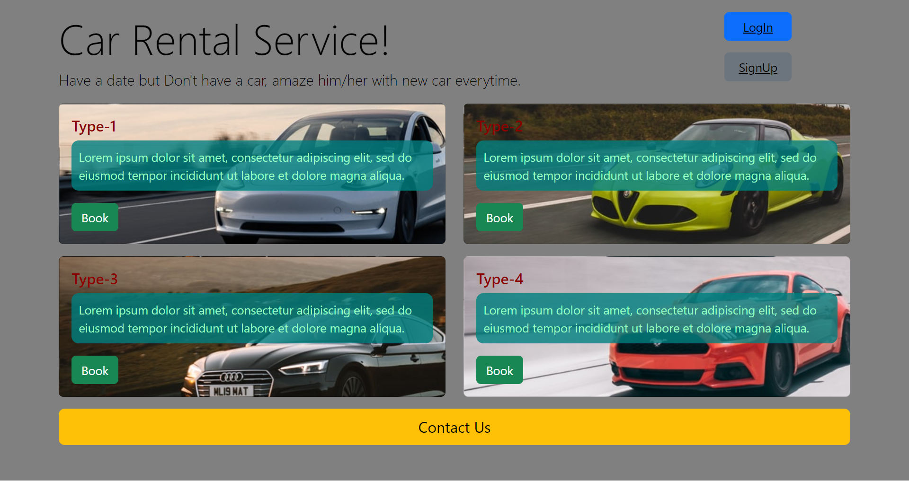
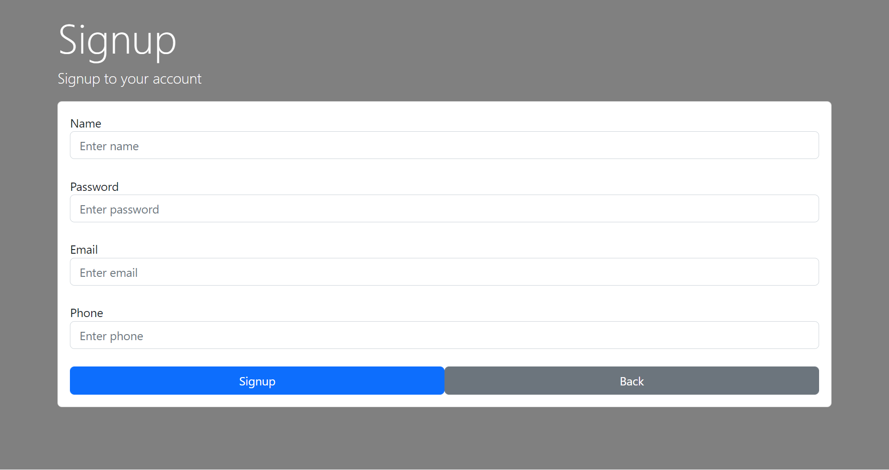
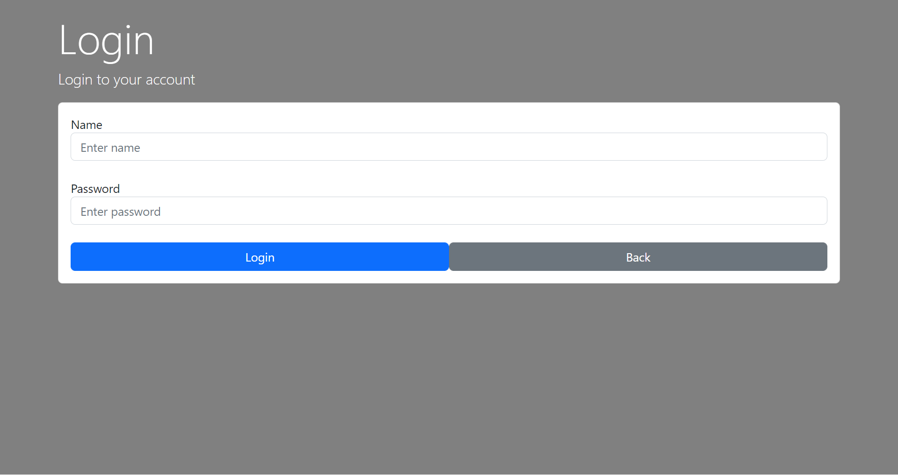
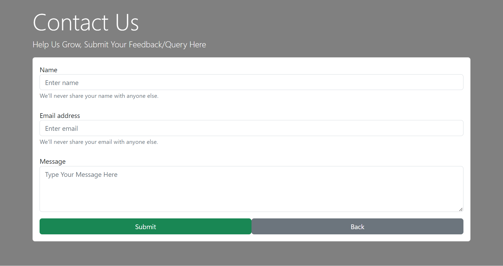
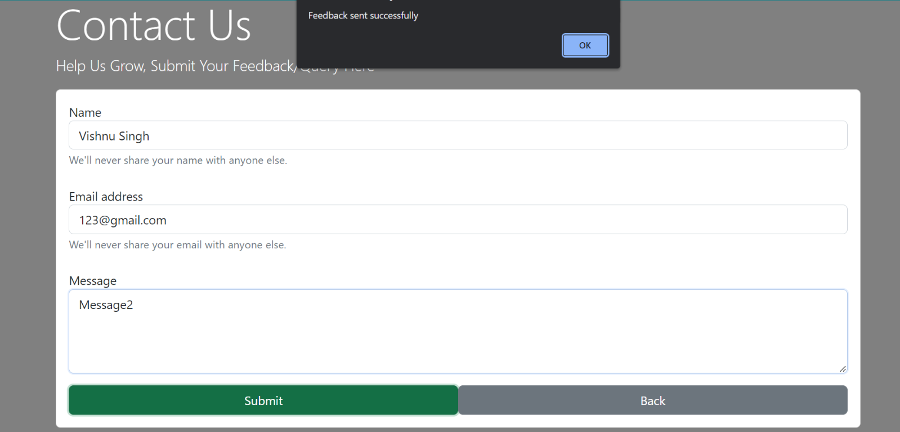
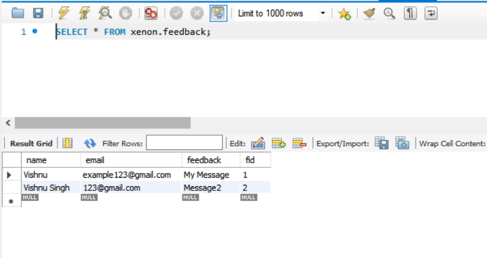

# Car Rental Service
An Car rrental Service that let you borrow car for a period of time with minimal cost.


<hr style="border-top: 1px dashed white;border-bottom: 1px dashed white;">

<br>


## Technologies Used : <br>
Frontend<br>


<br>
Backend<br>

<br>
Database<br>

<br>

<br>
<hr style="border-top: 1px dashed white;border-bottom: 1px dashed white;">
<br>

## How to get the code

Open the folder you want to clone git repo in command prompt
### You Could get the code by using the following command:
```
git clone https://github.com/Vishnu8989/XENONSTACK_Assignment.git
```
Now Code is on your machine.

The Whole project is divided into 2 parts<br>
1. Frontend<br>
Now follow the steps below to setup the frontend
* go to the folder where you cloned the code then follow the steps below
```
    cd XENONSTACK_Assignment
    cd myapp
    npm install
```
1. Backend<br>
Now follow the steps below to setup the backend
* go to the folder where you cloned the code then follow the steps below
```
    cd XENONSTACK_Assignment
    cd Backend
```

<br>
<hr style="border-top: 1px dashed white;border-bottom: 1px dashed white;">
<br>

## How to Run the project

Creating the Database (MYSQL Database is Used)
Creating User Table
```
CREATE TABLE `xenon`.`users` (
  `username` VARCHAR(30) NOT NULL,
  `userid` INT NOT NULL AUTO_INCREMENT,
  `pass` VARCHAR(45) NOT NULL,
  PRIMARY KEY (`userid`),
  UNIQUE INDEX `username_UNIQUE` (`username` ASC) VISIBLE);
 ALTER TABLE `xenon`.`users` 
ADD COLUMN `email` VARCHAR(45) NULL AFTER `pass`,
ADD COLUMN `phone` VARCHAR(45) NULL AFTER `email`;
```
Creating Feedback Table
```
CREATE TABLE `xenon`.`feedback` (
  `name` VARCHAR(45) NOT NULL,
  `email` VARCHAR(45) NOT NULL,
  `feedback` VARCHAR(45) NULL,
  `fid` INT NOT NULL AUTO_INCREMENT,
  PRIMARY KEY (`fid`));
```

Frontend<br>
Now follow the steps below to start the frontend application
* Go to the folder where you cloned the code then follow the steps below
```
    cd XENONSTACK_Assignment
    cd myapp
    npm install
    nom start
```
[ClickHere to get More Info About React App](./myapp/README.md)

Backend<br>
Now follow the steps below to start the backend application
* Go to the folder where you cloned the code then follow the steps below
```
    cd XENONSTACK_Assignment
    cd Backend
    python3 flaskApp.py
```

<br>
<hr style="border-top: 1px dashed white;border-bottom: 1px dashed white;">
<br>

The App Should Be running Now.

Here are some Demo Pic of the app:


<br>



<br>




<br>



<br>

<br>



<br>
Your Local DataBase should look like this:

<br>




<br>
<hr style="border-top: 1px dashed white;border-bottom: 1px dashed white;">
<br>

Adding New Feature Soon
